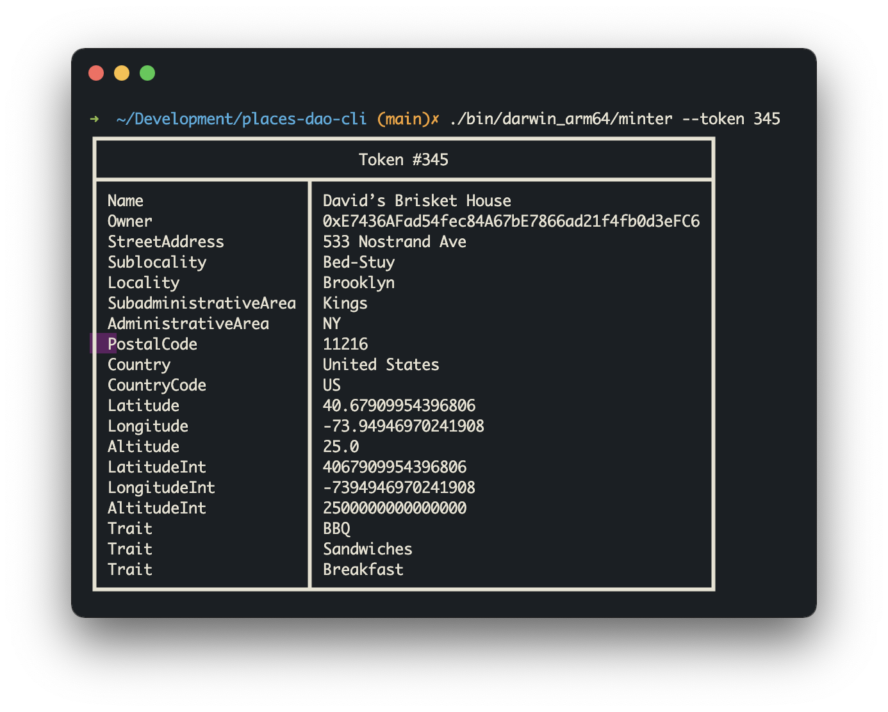

# PlacesDao CLI
This is quick tool that exposes the [PlacesDAO](https://places.xyz) project over a CLI.



## 💾 Installation
Assuming you have Go installed locally, you should be able to clone this repo and run directly with:

```go run .```

To build the binaries, 

```make```

## 📍 Usage

This CLI requires a local environment variable set to `ETH_NODE`. It should be an Ethereum RPC endpoint that looks something like `https://mainnet.infura.io/v3/YOUR_API_KEY"`.

There are three basic functions available. Each requires a CLI flag.

* `--token` is the token ID you're querying
* `--show` will display the dynamically rendered SVG file
* `--json` prints the json rendered from the contract

Two examples:

```
./bin/darwin_arm64/minter --token 123 --show --json
go run . --token 123
```


## 🔮 In The Future

* ENS Integration